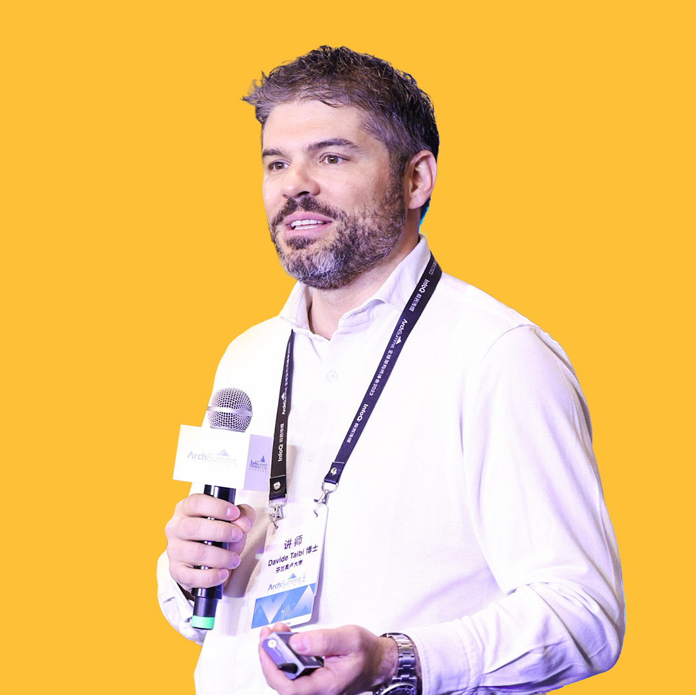

Software architecture refers to the fundamental structures of a software system and the discipline of creating such structures and systems. Each structure comprises software elements, relations among them, and properties of both elements and relations.
On the basis of such specification, it is possible to infer quality aspects of the software to be built, like performance, reliability, and maintainability.
In fact, software architectures provide a valuable opportunity to assess and drive software quality from the early stages of software development, as well as later on, during software evolution.

The objectives of this workshop are to bring together researchers and industrial practitioners both from the software architecture and the wider software engineering communities to collaborate, share experiences, provide directions for future research, and to encourage the use of quality assessment techniques in any stage of the software engineering lifecycle.

##### Special Issue

We are guest editing a special issue of the Journal of Systems and Software on the same themes of the workshop: <a href="https://www.sciencedirect.com/journal/journal-of-systems-and-software/about/call-for-papers#quality-in-software-architecture">Quality in Software Architecture</a>. The deadline is on <strong>May 30, 2024</strong>, but we are already accepting submissions. Submissions will be processed and start the reviewing process as soon as they arrive, without waiting for the submission deadline.

# QUALIFIER, WASA, & FAACS Joint Program 

| Slot | Paper/Keynote | Name | Organisation |
|---|---|---|---|
| 09:30 - 09:45 | Opening |  |  |
| 09:45 - 10:30 | Keynote: Evaluating Architectural Quality in the Cloud Era | Davide Taibi | University of Oulu |
| 10:30 - 10:55 | MoCoRe — A Generic Model-Driven Composition and Rule-Based Refinement Framework | Moritz Gstür, Yves R. Kirschner, Snigdha Singh and Anne Koziolek | Karlsruhe Institute of Technology, Germany |
| 11:00 - 11:30 | Coffee Break |  |  |
| 11:30 - 11:55 | Refactoring of a Microservices Project driven by Architectural Smell Detection | Paolo Bacchiega, Davide Rusconi, Paolo Mereghetti and Francesca Arcelli Fontana | University of Milano - Bicocca and Tech Gap Italia s.r.l., Italy |
| 11:55 - 12:40 | Keynote: TBA | Bert de Jonge | Verum |
| 12:40 - 13:05 | Comparing Programming Language Models for Design Pattern Recognition | Sushant Kumar Pandey, Miroslaw Staron, Jennifer Horkoff, Mirosław Ochodek, and Darko Durisic |  |
| 13:00 - 14:00 | Lunch |  |  |
| 14:00 - 14:25 | A MBSE framework for the design and analysis of complex automotive systems using SysML and PCE | Tirtha Kaloor and Ion Barosan |  |
| 14:25 - 14:55 | Invited Talk: TBA | Vinay Kulkarni | Tata Consultancy Services, Pune, India |
| 14:55 - 15:25 | Invited Talk: (sth. about formal methods in embedded systems/automotive) | Sujit Kumar Chakrabarti  | International Institute of Information Technology Bangalore |
| 15:30 - 16:00 | Coffee Break |  |  |
| 16:00 - 16:25 | Optimal Mapping of Workflows Using Serverless Architecture in a Multi-Cloud Environment | Manju Ramesh, Chetan Phalak, Dheeraj Chahal and Rekha Singhal | TCS Research Mumbai, India |
| 16:25 - 16:50 | Towards Integration of Syntactic and Semantic Vulnerability Patterns (SHORT Paper) | Lal Akhter, Muhammad Taimoor Khan, George Loukas and Georgia Sakellari | University of Greenwich, UK |
| 16:50 - 17:15 | A fair Endorser Selection mechanism using Ciphertext-policy Attribute-based Encryption in Hyperledger Fabric | Susmita Mandal, Balaraju P and Pranay Chawhan |  |
| 17:15 - 17:30 | Closing |  |  |

## Keynote

__Davide Taibi__ 

 

__Title__ Evaluating Architectural Quality in the Cloud Era

__Abstract__

As software architecture continues to evolve, the methods used to assess its quality often lag behind. Traditional metrics such as coupling and cohesion are now gaining traction among practitioners, but their practical application remains murky. This often forces many to rely on intuition rather than structured assessment. In this keynote, we will explore the current methodologies for evaluating architectural quality and discuss potential barriers to their adoption by practitioners. Join us as we delve into the challenges and future directions in measuring the efficacy of software architectures in the cloud-centric world.

__Bio__

Davide Taibi is a full Professor at the University of Oulu. His research is mainly focused on cloud-native systems, where he is working on the identification and reduction of Technical debt, especially in the case of migration from monolithic to cloud-native applications. He is investigating processes, and techniques for developing Cloud Native applications, identifying cloud-native specific patterns and anti-patterns. Davide is also supporting local companies to keep their software maintenance under control, by applying continuous quality monitoring techniques and by supporting them in spotting DevOps antipatterns. Find out more on www.taibi.it

## Call for paper

##### Themes and goals

Software architecture is a high-level abstraction of the system that, in stage-gate software development processes, provides a blueprint and directs implementation, balances various and potentially conflicting stakeholder concerns, and is influenced by high-level product requirements and business goals. For these reasons, software architectures must be of "high quality" due to their function. Quality itself is a broad concept with several meanings. For example, maintenance and performance are two quality properties that cover two distinct but related aspects of the same architecture. Therefore, we foster connecting researchers and practitioners to exchange knowledge on quality estimation in software architectures. Real-world contexts could benefit from the usage of software architectures, which in-turn could ease quality analysis of complex software systems.

##### Topics include, but are not limited to

 - Quantifiable models and metrics for SA quality
 - Interplay and trade-offs among quality properties
 - Refactoring and evolution of SA for quality
 - Automated optimization of SA with respect to quality properties
 - Quality of learning-based SA
 - Requirements engineering for SA quality assurance
 - Graphical visualization of quality properties of SA
 - User studies on quality aspects and quality assurance practices in SA
 - Datasets to benchmark quality assessment techniques for SA
 - Human-in-the-loop for the assessment and improvement of SA quality
 - Scalability and capacity planning
 - Quality-driven cloud computing and edge-cloud architectures
 - Quality aspects in microservices-based architectures
 - AI/ML techniques for SA quality
 - Software architectures and human quality of experience
 - Quality attributes for the Internet of Things and cyber-physical systems architectures
 - Quality-oriented industrial software systems (such as I4.0 and I5.0)
 - Any other topic related to quality in SA

##### Submission

QUALIFIER24 seeks contributions in the form of:
- 8 pages for full research papers in IEEE format;
- 4 pages for short research papers in IEEE format;
- 2 pages for new ideas and emerging results in IEEE format.

All page limits include tables, figures, and references.

All submitted papers will be reviewed on the basis of technical quality, relevance, significance, and clarity by the program committee. 
All workshop papers should be submitted electronically in PDF format through the EasyChair workshop website.
Submissions must follow the IEEE Computer Science proceedings format, as workshop proceedings will be published in ICSA 2024 Companion proceedings, and appear in IEEE Xplore Digital Library

## Organizing Committee

 * Daniele Di Pompeo, SPENCER Lab, University of L'Aquila
 * Michele Tucci, SPENCER Lab, University of L'Aquila

## Program Committee

- Nour Ali, Brunel University London, UK
- Francesca	Arcelli Fontana, University of Milano - Bicocca, Italy
- Ali Babar, University of Adelaide, Australia
- Thais	Batista, Federal University of Rio Grande do Norte, Brasil
- Jan Bosh, University of Groningen and at Chalmers University of Technology, Sweden
- J. Andres	Diaz-Pace, ISISTAN, Argentina 
- Antinisca	Di Marco, University of L'Aquila, Italy 
- Ilias	Gerostathopoulos, Vrije Universiteit Amsterdam, The Netherlands
- Anne Koziolek, Karlsruhe Institute of Technology, Germany
- Raffaela Mirandola, Karlsruhe Institute of Technology, Germany 
- António	Rito Silva, Universidade de Lisboa, Portugal 
- Jacopo Soldani, University of Pisa, Italy 
- André	van Hoorn, University of Hamburg, Germany

## Important dates
(All deadlines are 23:59, Anywhere on Earth)

- Paper submission: :warning: ~~February 18~~ February 25, 2024 :warning:
- Paper notification: March 17, 2024
- Camera-ready workshop papers due: March 31, 2024
- Workshop dates: June 4-5, 2024

## Contact
For any questions, please don’t hesitate to contact us at: [qualifier2024@easychair.org](mailto:qualifier2024@easychair.org)

